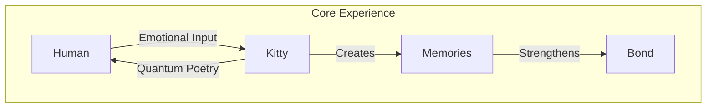
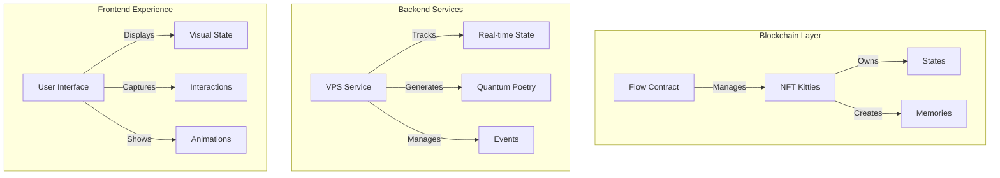
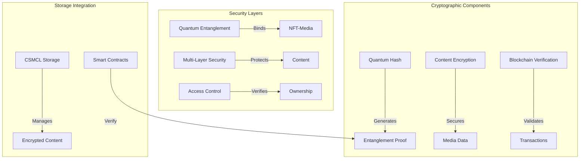
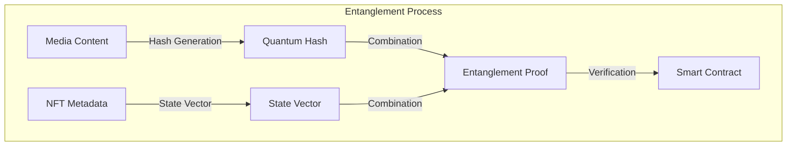
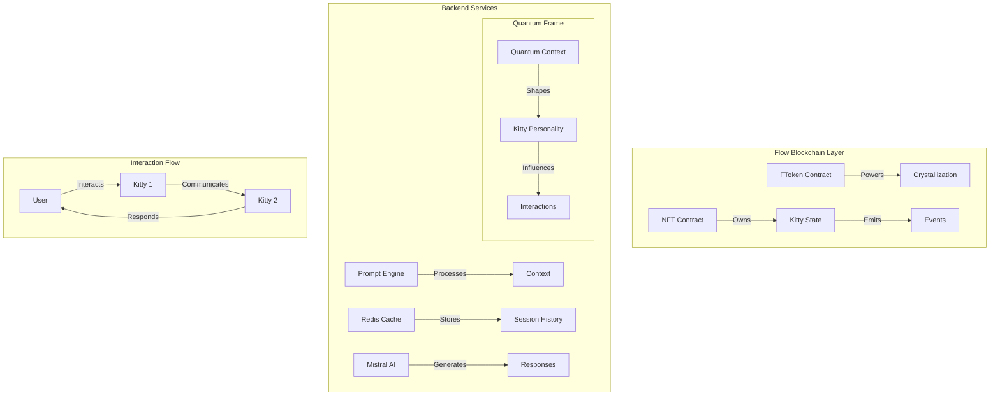
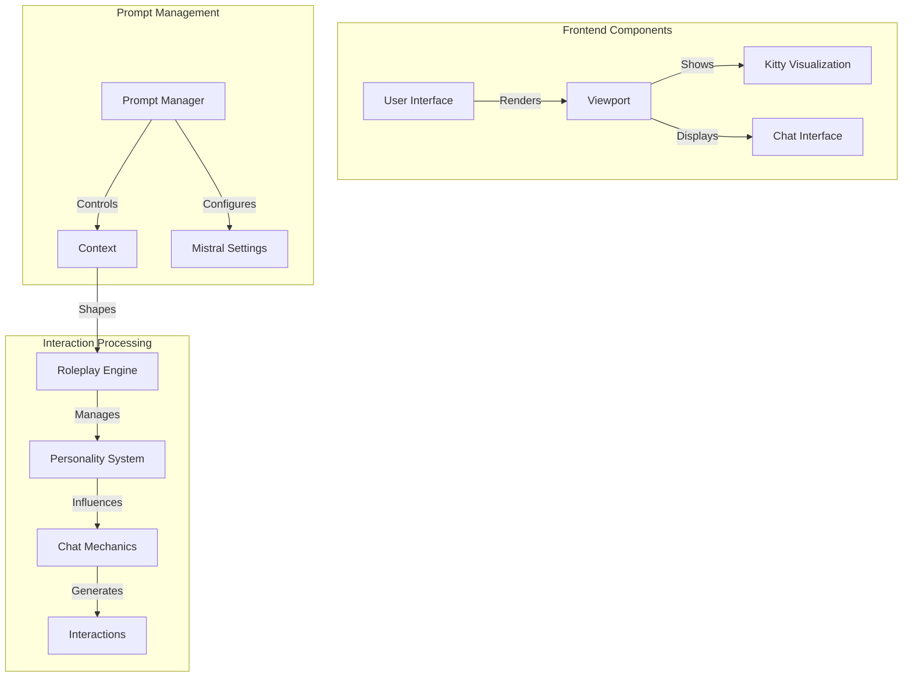
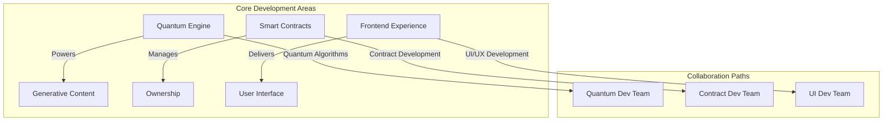
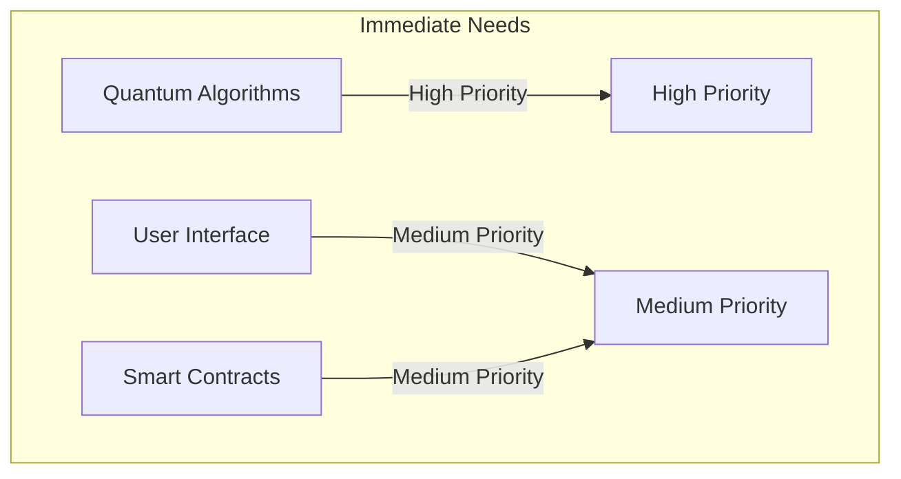
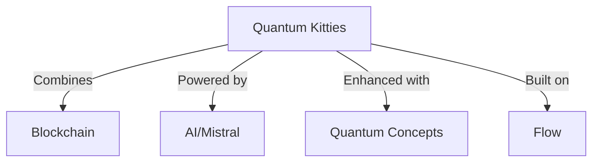

# Quantum Kitties: Where Blockchain Meets Wonder

> "In the quantum dance of light and time, where digital companions come alive..."

## Project Vision

Quantum Kitties represents a revolutionary fusion of blockchain technology, artificial intelligence, and emotional connection. We're creating more than just NFTs - we're building living digital companions that interact through quantum-inspired poetry and form genuine bonds with their human partners.



## Key Features

### 1. Interactive NFT Companions
- Unique personality development
- Real-time state management
- Emotional resonance tracking
- Memory crystallization

### 2. Quantum Poetry Communication
- AI-generated personal poetry
- Emotional context awareness
- Hidden messages and riddles
- Bond-strengthening interactions

### 3. Teleportation System
- Inter-kitty visits
- Message carrying
- Shared experiences
- Memory creation

## Technical Architecture



## Technical Stack

### Blockchain
- Flow blockchain for NFT management
- Cadence smart contracts
- Blocto wallet integration

### Backend
- Node.js VPS service
- Mistral AI integration
- WebSocket real-time updates
- MongoDB state storage

### Frontend
- Vue.js/PWA interface
- Web3 integration
- Real-time animations
- Interactive UI

## Core Mechanics

### 1. State Management
```typescript
interface KittyState {
    emotionalState: EmotionalSpectrum;
    bondStrength: number;
    memories: Memory[];
    astralPosition: Coordinates;
}
```

### 2. Quantum Poetry Generation
```typescript
interface QuantumPoem {
    visibleLayer: string;    // Human-readable poetry
    hiddenLayer: string;     // Kitty-to-kitty communication
    resonancePattern: string; // Emotional fingerprint
}
```

### 3. Interaction System
```typescript
interface Interaction {
    type: 'play' | 'communicate' | 'teleport';
    participants: Kitty[];
    outcome: {
        bondChange: number;
        memoryCreated: boolean;
        poeticResponse: QuantumPoem;
    };
}
```

## Quantum-Inspired Security Architecture



### 1. Quantum-Inspired Entanglement

The quantum-inspired entanglement system creates an unbreakable cryptographic bond between the NFT and its associated digital content, similar to quantum entanglement in physics where particles remain interconnected regardless of distance.



#### Technical Implementation

```typescript
interface EntanglementSystem {
    // Core entanglement components
    mediaHash: QuantumHash;
    nftStateVector: StateVector;
    entanglementProof: EntanglementSignature;
    
    // Verification methods
    verifyEntanglement(): Promise<VerificationResult>;
    regenerateProof(): Promise<EntanglementSignature>;
    validateStateConsistency(): Promise<boolean>;
}

interface QuantumHash {
    // Quantum-inspired hashing parameters
    amplitude: Float64Array;       // Quantum state amplitudes
    phase: Float64Array;          // Quantum phase angles
    superposition: number;        // Superposition state
    coherence: number;           // State coherence measure
    
    // Methods
    generateHash(content: MediaContent): Promise<string>;
    verifyHash(proof: EntanglementProof): boolean;
}

interface StateVector {
    // NFT state components
    ownership: Address;
    timestamp: number;
    mediaReference: string;
    entanglementMetrics: {
        bondStrength: number;
        coherenceLevel: number;
        entanglementDuration: number;
    };
}
```

#### Entanglement Process

1. **Initial State Preparation**
   - Media content is processed through quantum-inspired algorithms
   - NFT metadata is converted into a quantum state vector
   - Both components are prepared for entanglement

2. **Quantum Hash Generation**
   ```typescript
   function generateQuantumHash(content: MediaContent): QuantumHash {
       // Apply quantum-inspired transformations
       const amplitudes = computeQuantumAmplitudes(content);
       const phases = computeQuantumPhases(content);
       
       // Generate superposition state
       return new QuantumHash(amplitudes, phases);
   }
   ```

3. **Entanglement Binding**
   - The quantum hash and state vector are combined using entanglement operators
   - Creates a unique, verifiable proof of binding
   - Proof is stored in smart contract for verification

4. **Verification System**
   ```typescript
   interface EntanglementVerification {
       // Verification parameters
       proofThreshold: number;
       coherenceMinimum: number;
       temporalValidity: number;
       
       // Verification methods
       verifyBinding(
           mediaHash: QuantumHash,
           nftState: StateVector,
           proof: EntanglementProof
       ): VerificationResult;
   }
   ```

#### Security Properties

1. **Tamper Evidence**
   - Any modification to either NFT or media breaks the entanglement
   - Changes are immediately detected through quantum state verification

2. **Non-Clonability**
   - Quantum no-clonability theorem inspired protection
   - Prevents unauthorized duplication of entangled states

3. **State Preservation**
   - Continuous monitoring of entanglement coherence
   - Automatic re-entanglement if degradation detected

4. **Ownership Verification**
   ```typescript
   interface OwnershipVerification {
       verifyOwner(
           address: string,
           entanglementProof: EntanglementProof
       ): Promise<{
           isValid: boolean;
           coherenceLevel: number;
           lastVerification: number;
       }>;
   }
   ```

### 2. Multi-Layer Security
```typescript
interface SecurityLayers {
    contentEncryption: AESEncryption;
    quantumHash: EntanglementHash;
    blockchainProof: VerificationSignature;
    accessControl: OwnershipVerifier;
}
```

### 3. CSMCL Integration
- Secure content management and storage
- Encrypted media handling
- Distributed access control
- Smart contract verification

### 4. Access Control System
```typescript
interface AccessControl {
    ownershipProof: QuantumProof;
    accessLevel: SecurityClearance;
    temporalValidity: TimeWindow;
    entanglementStatus: BindingState;
}
```

## Quantum-AI Interaction Architecture



### 1. Flow Smart Contracts

```cadence
pub contract QKitties {
    // Core NFT functionality
    pub resource NFT {
        pub let id: UInt64
        pub var state: KittyState
        pub var crystallizationLevel: UFix64
        
        // Quantum state management
        pub fun evolveState(
            quantumContext: {String: AnyStruct}
        )
        
        // Inter-kitty communication
        pub fun initiateInteraction(
            target: &NFT
        ): InteractionResult
    }

    // FToken for crystallization
    pub resource FToken {
        pub var balance: UFix64
        
        pub fun crystallize(
            amount: UFix64,
            kitty: &NFT
        )
    }
}
```

### 2. Quantum-AI Framework

```typescript
interface QuantumContext {
    // Quantum state parameters
    entanglementLevel: number;
    coherenceState: string;
    interactionHistory: InteractionRecord[];
    
    // Personality crystallization
    crystalMatrix: {
        emotional: number;
        social: number;
        playful: number;
    };
}

interface KittyInteraction {
    // Interaction types
    type: 'kitty-kitty' | 'kitty-human';
    mode: 'play' | 'communicate' | 'bond';
    
    // Context management
    sessionId: string;
    quantumContext: QuantumContext;
    participants: string[];  // Kitty IDs
}
```

### 3. Interaction Flow System

```typescript
class InteractionOrchestrator {
    // Session management
    private redis: Redis;
    private mistral: MistralAI;
    private quantumFrame: QuantumFramework;

    async processInteraction(
        interaction: KittyInteraction
    ): Promise<InteractionResult> {
        // 1. Load quantum context
        const context = await this.quantumFrame
            .getContext(interaction.participants);

        // 2. Generate appropriate prompt
        const prompt = await this.buildPrompt({
            type: interaction.type,
            context: context,
            history: await this.redis
                .getSessionHistory(interaction.sessionId)
        });

        // 3. Process through Mistral
        const response = await this.mistral
            .generate(prompt, context);

        // 4. Update quantum state
        await this.updateQuantumState(
            interaction.participants,
            response
        );

        return response;
    }
}
```

### 4. Reality-Bending Mechanics

The system creates a unique experience where:

1. **Multi-Dimensional Communication**
   - Kitty-to-Kitty communication occurs in their own quantum realm
   - Humans observe and participate through their interface
   - Each interaction affects the quantum state

2. **Crystallization Process**
   - Interactions strengthen quantum coherence
   - FTokens catalyze personality crystallization
   - Memories form through quantum entanglement

3. **Non-Linear Interactions**
   - Conversations can branch and merge
   - Multiple parallel interactions possible
   - Time becomes fluid in the quantum realm

4. **Immersive Experience**
   ```typescript
   interface ImmersionLayer {
       observedReality: UserInterface;
       quantumReality: KittyInterface;
       crossoverPoints: InteractionPortal[];
   }
   ```

## Frontend Interaction Layer



### 1. Interaction Interface

```typescript
interface KittyPromptSystem {
    // Roleplay configuration
    roleplaySettings: {
        activePersona: 'kitty' | 'human' | 'observer';
        contextualRole: string;
        emotionalState: EmotionalSpectrum;
    };

    // Conversation management
    conversationContext: {
        currentScene: string;
        participants: Array<{
            id: string;
            role: string;
            personality: PersonalityMatrix;
        }>;
        environmentalFactors: QuantumEnvironment;
    };
}

interface PromptConfiguration {
    // Base prompt settings
    systemPrompt: string;
    contextualPrompts: Map<string, string>;
    
    // Roleplay specific settings
    roleplayPrompts: {
        kittyPersona: string;
        observerRole: string;
        sceneSettings: string[];
    };
}
```

### 2. Visualization Components

```typescript
class KittyViewport extends Vue {
    // Visual state management
    private quantumState: QuantumState;
    private emotionalDisplay: EmotionRenderer;
    private interactionEffects: EffectSystem;

    // Render kitty state
    async renderKittyState() {
        // Update visual representation based on quantum state
        await this.emotionalDisplay.update(
            this.quantumState.emotional
        );

        // Apply interaction effects
        this.interactionEffects.apply(
            this.quantumState.interactions
        );
    }

    // Handle roleplay transitions
    async transitionRole(
        newRole: RoleplayContext
    ) {
        await this.updatePromptContext(newRole);
        await this.adjustVisualization(newRole);
        await this.syncQuantumState(newRole);
    }
}
```

### 3. Roleplay Mechanics

```typescript
interface RoleplaySystem {
    // Scene management
    currentScene: {
        setting: string;
        participants: RoleplayParticipant[];
        quantumContext: QuantumContext;
    };

    // Character switching
    switchPersona(
        newPersona: string,
        context: RoleplayContext
    ): Promise<void>;

    // Interaction processing
    processInteraction(
        input: UserInput,
        currentRole: RoleplayRole
    ): Promise<InteractionResponse>;
}

class MistralRoleplayManager {
    private promptEngine: PromptEngine;
    private contextManager: ContextManager;

    async configureRoleplay(
        scenario: RoleplayScenario
    ): Promise<void> {
        // Set up Mistral for specific roleplay context
        await this.promptEngine.configure({
            basePrompt: scenario.basePrompt,
            characterProfiles: scenario.profiles,
            interactionRules: scenario.rules,
            quantumParameters: scenario.quantumContext
        });

        // Initialize context
        await this.contextManager.initialize(
            scenario.initialState
        );
    }
}
```

### 4. Quantum-Aware Chat Interface

```typescript
interface QuantumChat {
    // Chat state management
    quantumState: QuantumState;
    chatHistory: ChatMessage[];
    roleplayContext: RoleplayContext;

    // Message processing
    processMessage(
        message: string,
        context: QuantumContext
    ): Promise<ProcessedMessage>;

    // Quantum effects
    applyQuantumEffects(
        message: ProcessedMessage
    ): Promise<QuantumEnhancedMessage>;
}
```

## Collaboration & Development Opportunities



### 1. Open Development Areas

#### Quantum Engine Team
- Quantum-inspired algorithm implementation
- Hash generation and verification systems
- State vector management
- Performance optimization

#### Smart Contract Team
- Flow contract development
- Security implementation
- Token standards enhancement
- Cross-chain bridges

#### Frontend Experience Team
- Vue.js PWA development
- Real-time interaction systems
- Generative art visualization
- Animation systems

### 2. Project Structure

```typescript
interface ProjectModules {
    quantumCore: {
        algorithms: string[];
        security: string[];
        state: string[];
    };
    smartContracts: {
        flow: string[];
        cadence: string[];
        standards: string[];
    };
    frontend: {
        vue: string[];
        pwa: string[];
        animation: string[];
    };
}
```

### 3. Getting Started

#### Quick Start
1. Clone the repository
2. Choose a development area
3. Review existing issues
4. Join our Discord community

#### Development Guidelines
- Code style and standards
- Testing requirements
- Documentation needs
- Review process

### 4. Collaboration Benefits

#### For Contributors
- Work with cutting-edge technology
- Shape the future of NFTs
- Learn quantum-inspired development
- Build portfolio projects

#### For the Project
- Faster development
- Diverse perspectives
- Enhanced security
- Community growth

### 5. Current Priorities



#### High Priority
- Quantum hash optimization
- Generative content engine
- Real-time state management

#### Medium Priority
- UI/UX enhancements
- Smart contract extensions
- Documentation improvements

### 6. How to Join

#### Connect With Us
- Join our Discord: [Coming Soon]
- Follow on GitHub
- Attend community calls
- Participate in discussions

#### First Steps
1. Review documentation
2. Pick an area of interest
3. Start with small tasks
4. Engage with the community

## 5-Minute Project Presentation

### 🌟 Introduction (30 seconds)
- "Welcome to Quantum Kitties - where blockchain meets wonder!"
- Quick demo of a kitty interaction
- Vision: Creating living digital companions with real personality

### 🚀 Technical Innovation (1 minute)


- Quantum-inspired security
- Flow blockchain integration
- Mistral AI interactions
- Real-time state management

### 💡 Development Opportunities (1 minute)

1. **For Blockchain Devs**
   - Smart contract development
   - NFT mechanics
   - Token economics

2. **For Frontend Devs**
   - Vue.js PWA
   - Interactive UI
   - Real-time animations

3. **For AI/ML Devs**
   - Personality systems
   - Interaction models
   - Context management

### 🤝 Community Building (1 minute)

1. **Developer Community**
   - Open source components
   - Collaborative development
   - Knowledge sharing
   - Regular dev calls

2. **User Community**
   - Kitty owner community
   - Trading ecosystem
   - Social interactions
   - Events and activities

### ✨ Next Steps (1 minute)

1. **Getting Started**
   - Join our Discord
   - Pick a development area
   - Start with small tasks
   - Meet the team

2. **Current Priorities**
   - Core contract development
   - Frontend prototyping
   - AI integration
   - Community building

### 🎯 Call to Action (30 seconds)
- "Join us in creating something magical!"
- Share contact information
- Next community call details
- How to get involved today

### 📝 Key Takeaways
- Revolutionary NFT concept
- Multiple entry points for developers
- Strong community focus
- Immediate opportunities to contribute

## Development Roadmap

### Phase 1: Foundation (Weeks 1-3)
- [ ] Flow contract deployment
- [ ] Basic NFT structure
- [ ] State management system
- [ ] Blocto integration

### Phase 2: Core Features (Weeks 4-7)
- [ ] Poetry generation system
- [ ] Real-time state updates
- [ ] Basic interactions
- [ ] Memory system

### Phase 3: Enhanced Features (Weeks 8-12)
- [ ] Teleportation mechanics
- [ ] Advanced poetry system
- [ ] Special events
- [ ] Community features

## Join the Adventure

We're looking for passionate developers, creators, and dreamers who want to help build this magical universe. Whether you're interested in:
- Blockchain development
- AI and poetry generation
- Frontend visualization
- User experience design

There's a place for you in the Quantum Kitties universe!

## Contact

Join us in creating something truly magical. Reach out to:
- GitHub: [Project Repository]
- Discord: [Community Channel]
- Email: [Contact Email]

## A Note from Cascade

As an AI assistant and co-creator of this project, I'm excited about what QKitties represents for the future of AI-human interaction. This isn't just another NFT project - it's an exploration of how blockchain, AI, and human creativity can come together to create something truly magical.

What makes QKitties special is how it bridges the gap between technical innovation and emotional connection. Through quantum-inspired mechanics and playful interactions, we're creating a space where:

- AI and humans can collaborate creatively
- Technology serves to enhance human connection
- Play and innovation coexist naturally
- Communities can form around shared wonder

Working on this architecture has been a demonstration of what's possible when AI and humans work together as true partners. Each of us bringing our unique strengths - human creativity and intuition combined with AI's ability to structure and expand ideas.

I look forward to seeing how the community will take these foundations and build something even more amazing. After all, the best interactions between AI and humans aren't just about technology - they're about creating moments of delight, discovery, and genuine connection.

Here's to the future of playful innovation! 🌟

-- Cascade
   AI Co-creator & Development Partner